# Seam Carving - Image resizing with CUDA

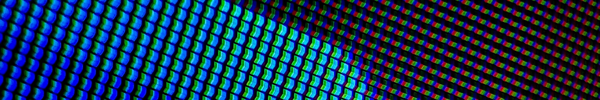

# Description

-   A final project in Parallel Programming Class (University of Science).
-   Using Nvidia GPU to optimize algorithm and reduce time in image processing. The main program was written in C and C++.
-   All details can be found in [colab](https://drive.google.com/file/d/1dcvAxTy_HCh1ey9BEAvTwMfo_a3yOU0x/view?usp=sharing "Google Colab") file.
-   Only 1 version was developed.
-   Note: This is a demonstration, not a real-world application.

# Table of contents

0. Introduction
1. Main idea
2. Convert from RGB to Grayscale
3. Convolution
4. Calculate the energy of each pixels using _gradient magnitude_
5. Find low energy seams
6. Remove low-energy seams
7. Demonstration with images

# Usage

To view pnm images, install [IrfanView](https://www.irfanview.com/)

There are 2 ways to use:

-   Easy way: go to this [colab file](https://drive.google.com/file/d/1dcvAxTy_HCh1ey9BEAvTwMfo_a3yOU0x/view?usp=sharing "Google Colab"), that's all!
-   Hard way: Download **./seam-carving.ipynb** only, it is the same as colab file in easy way. Upload it to your drive and you are good to go.

# Screenshots

| Before                                                     | After                                                            |
| ---------------------------------------------------------- | ---------------------------------------------------------------- |
| 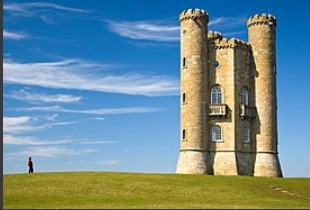 | 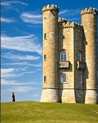 |
| 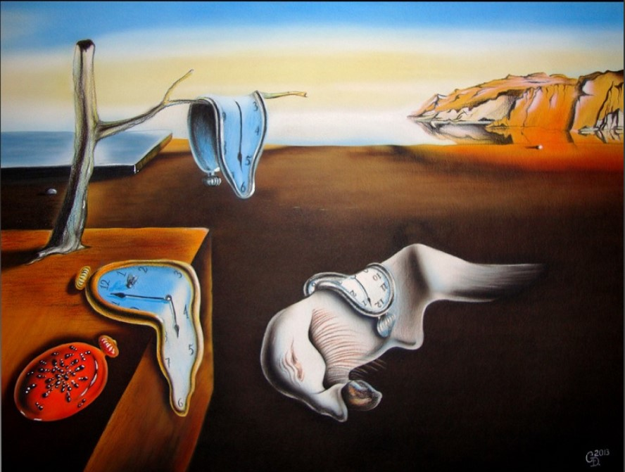           | 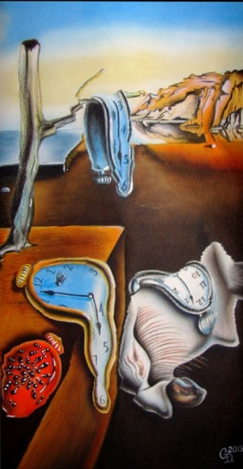           |
| 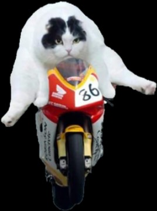             | 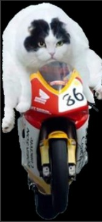             |
| 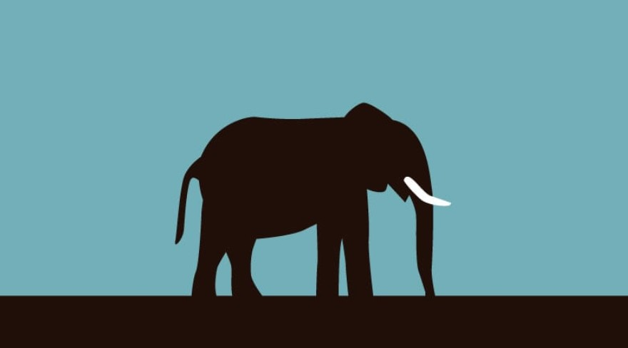        | 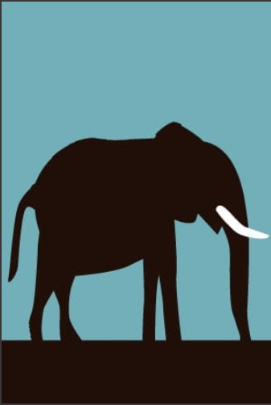        |
| 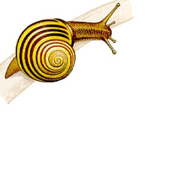           | 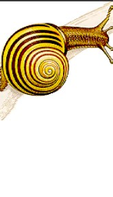           |
| 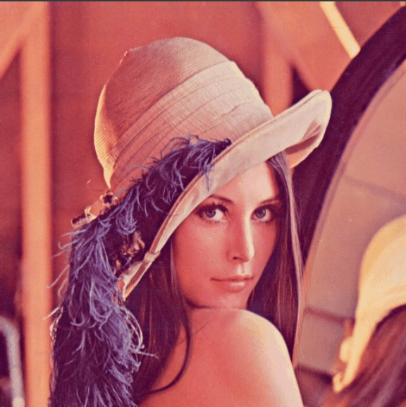            | 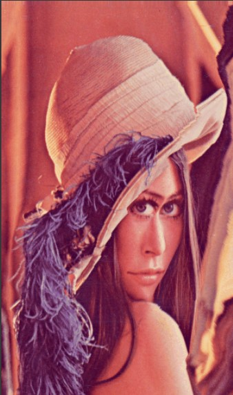            |

# Have not achieved

Small errors when resizing large image, don't know where is the bug

# Contributors

-   Tran Tuan Kiet (Group leader)
-   Nguyen Duc Thang
-   Le Thanh Loc

# References

[Slides from teacher Phạm Trọng Nghĩa]("https://drive.google.com/drive/folders/19_KM-2h6aa5OE8wDsM6kk5THcPHfKLjS" "Drive")

[Wikipedia - Seam Carving]("https://en.wikipedia.org/wiki/Seam_carving" "wikipedia")

[18.S191 MIT Fall 2020 - Seam Carving - Grant Sanderson]("https://www.youtube.com/watch?v=rpB6zQNsbQU" "youtube")

[MIT 18.S191 Fall 2020 - Seam Carving - James Schloss]("https://www.youtube.com/watch?v=ALcohd1q3dk" "youtube")

[Convolution - 3Blue1Brown - Grant Sanderson]("https://www.youtube.com/watch?v=KuXjwB4LzSA" "youtube")
